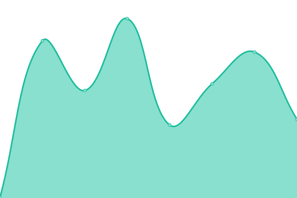
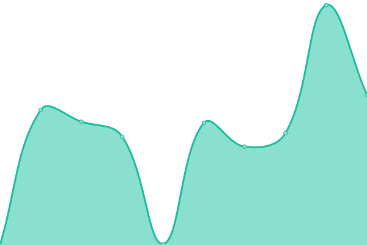
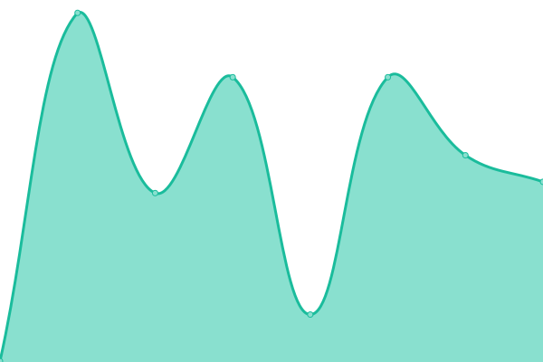

# [📈 Live Status](https://upptime.uncovered.com): <!--live status--> **🟩 All systems operational**

This repository contains the open-source uptime monitor and status page for [Uncovered.](https://uncovered.com), powered by [Upptime](https://github.com/upptime/upptime).

With [Upptime](https://upptime.js.org), you can get your own unlimited and free uptime monitor and status page, powered entirely by a GitHub repository. We use [Issues](https://github.com/uncovered-crime/upptime/issues) as incident reports, [Actions](https://github.com/uncovered-crime/upptime/actions) as uptime monitors, and [Pages](https://upptime.uncovered.com) for the status page.

<!--start: status pages-->
<!-- This summary is generated by Upptime (https://github.com/upptime/upptime) -->
<!-- Do not edit this manually, your changes will be overwritten -->
<!-- prettier-ignore -->
| URL | Status | History | Response Time | Uptime |
| --- | ------ | ------- | ------------- | ------ |
|  [Uncovered Homepage](https://uncovered.com) | 🟩 Up | [uncovered-homepage.yml](https://github.com/uncovered-crime/upptime/commits/HEAD/history/uncovered-homepage.yml) | 

 144ms
     
 | 

<a href="https://upptime.uncovered.com/history/uncovered-homepage">100.00%</a>
    

|  [Uncovered Wordpress](https://uncoveredsite.wpengine.com) | 🟩 Up | [uncovered-wordpress.yml](https://github.com/uncovered-crime/upptime/commits/HEAD/history/uncovered-wordpress.yml) | 

 398ms
     
 | 

<a href="https://upptime.uncovered.com/history/uncovered-wordpress">100.00%</a>
    

|  [Uncovered Wordpress API](https://uncoveredsite.wpengine.com/wp-json/wp/v2/pages?per_page=100&page=1) | 🟩 Up | [uncovered-wordpress-api.yml](https://github.com/uncovered-crime/upptime/commits/HEAD/history/uncovered-wordpress-api.yml) | 

 5397ms
     
 | 

<a href="https://upptime.uncovered.com/history/uncovered-wordpress-api">100.00%</a>
    

|  [Uncovered Cases](https://uncovered.com/cases) | 🟩 Up | [uncovered-cases.yml](https://github.com/uncovered-crime/upptime/commits/HEAD/history/uncovered-cases.yml) | 

 130ms
     
 | 

<a href="https://upptime.uncovered.com/history/uncovered-cases">100.00%</a>
    

|  [Uncovered API](https://api.uncovered.com) | 🟩 Up | [uncovered-api.yml](https://github.com/uncovered-crime/upptime/commits/HEAD/history/uncovered-api.yml) | 

 246ms
     
 | 

<a href="https://upptime.uncovered.com/history/uncovered-api">100.00%</a>
    

<!--end: status pages-->

[**Visit our status website →**](https://upptime.uncovered.com)

## 📄 License

- Powered by: [Upptime](https://github.com/upptime/upptime)
- Code: [MIT](./LICENSE) © [Anand Chowdhary](https://anandchowdhary.com), supported by [Pabio](https://pabio.com)
- Data in the `./history` directory: [Open Database License](https://opendatacommons.org/licenses/odbl/1-0/)
